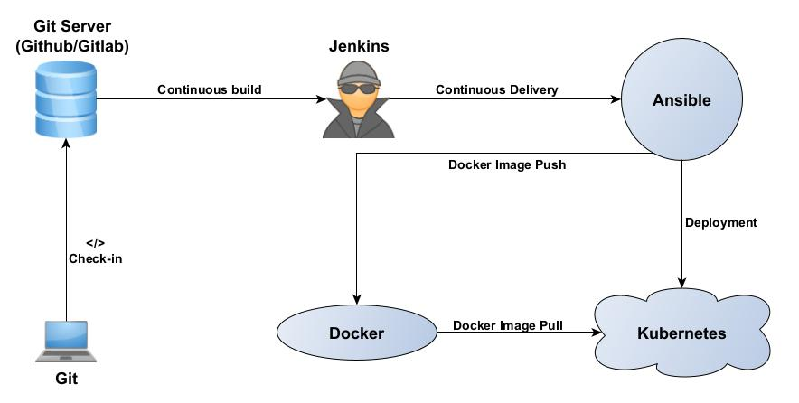
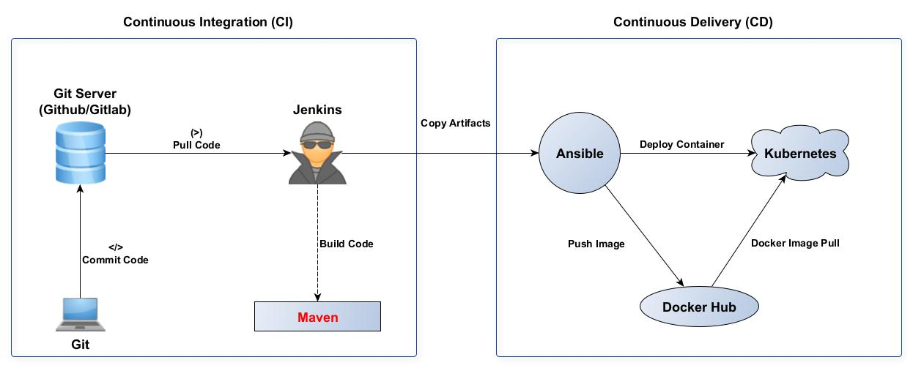

This Repository is a collection of Implementation documents about Simple DevOps.

### DevOps Simple Map

### Purpose:
By following this repository you can able to setup a DevOps Simple CI/CD Pipeline using
- git
- Jenkins
- Maven
- Ansible
- Docker 
- Terraform
- Kubernetes
### CI/CD Build

